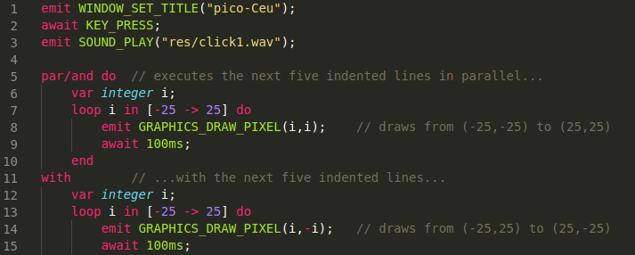

# Céu for Visual Studio Code

[Extension repository](https://github.com/AnnyCaroline/ceu-vscode)

This extension adds syntax highlighting suport for the [Céu language](http://ceu-lang.org) to VS Code.



## Instalation
On Linux or macOS, move this repository to ```~/.vscode/extensions``` folder. On Windows, move to ```%USERPROFILE%\.vscode\extensions```.

## Known Issues
[Known Issues](https://github.com/AnnyCaroline/ceu-vscode/issues)

-----------------------------------------------------------------------------------------------------------

## Release Notes

### 0.1

Initial release
